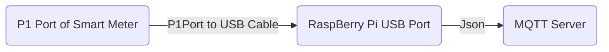
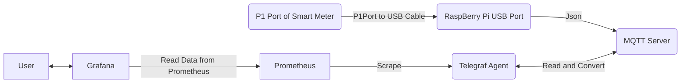

# smartmeter-reader

Read data from your Smart Meter in Meter Kast. Using P1 Port to USB connecting wire, Raspberry Pi and this program.

# Introduction
If you stay in the Netherlands, then your energy provider has probably installed a smartmeter at your house. This smartmeter has a P1 port, using which you can extract energy readings (Electricity and Gas) every 10 seconds. The readings can be used further for your purpose. 

The diagram shows high level picture of how data is extracted from your SlimmeMeter.




## Serial Reader
This module is a go program. It reads the P1 Telegram from smartmeter and creates a JSON message. After creating the message, it will send it to MQTT server.
### Datagram Schema

The output is derived based on Meter reader format called DSMR.
Refer https://www.netbeheernederland.nl/_upload/Files/Slimme_meter_15_32ffe3cc38.pdf to know more about this message format.
We convert the text data stream sent by smart meter into stream of Json Messages.

Here is sample Json Message which we get as output.

```{r, engine='javascript', count_lines}
[
    {
        "Manufacture_spec": "",
        "Version_info": "50",
        "Date_timestamp": "2018-09-01T08:55:00Z",
        "Equipment_id": "",
        "Electricity_incoming_tariff1_kwh": 3.369,
        "Electricity_outgoing_tariff1_kwh": 1.795,
        "Electricity_incoming_tariff2_kwh": 12.956,
        "Electricity_outgoing_tariff2_kwh": 1.322,
        "Tarrif_id": "",
        "Actualpower_incoming_kW": 0.202,
        "Actualpower_outgoing_kW": 0,
        "InstantaneousPower_incoming_L1_kW": 0.015,
        "InstantaneousPower_incoming_L2_kW": 0.18,
        "InstantaneousPower_incoming_L3_kW": 0,
        "InstantaneousPower_outgoing_L1_kW": 0,
        "InstantaneousPower_outgoing_L2_kW": 0,
        "InstantaneousPower_outgoing_L3_kW": 0,
        "Power_failure_count": 6,
        "Power_failure_history": [],
        "L1_voltage_sag_count": 0,
        "L1_voltage_swell_count": 2,
        "Text_msg": "",
        "Text_msg_maxchars": 0,
        "Instantaneous_current_l1_amp": 0,
        "Instantaneous_current_l2_amp": 1,
        "Instantaneous_current_l3_amp": 0,
        "Instantaneous_activepower_incoming_kW": 0,
        "Instantaneous_activepower_outgoing_kW": 0,
        "Gas_device_type": "003",
        "Gas_device_id": "1234",
        "Gas_readings": [
            {
                "Capture_time": "0001-01-01T00:00:00Z",
                "Value_m3": 1520.211
            }
        ],
        "Crc_string": ""
    },
]
```

# Usage
To use this program, you either have to build it yourself or use the docker image.
Docker image is right now only available for arm based machines (Raspberry Pi and its derivatives)

## Build it yourself (for Linux or Arm)

Serial Reader needs to be compiled for target platform. Following code builds for ARM devices (example: Raspberry Pi / C.H.I.P etc)
```{r, engine='bash', count_lines}
./build_arm.sh
```
To compile on Linux we use 
```{r, engine='bash', count_lines}
./build_linux.sh
```
If this script runs successfully, they you will get a binary in current directory.

## Running Binary
To know all options, run 
```{r, engine='bash', count_lines}
smartmeter_reader_arm -h
```
### Options
```{r, engine='bash', count_lines}
Usage of ./smartmeter_reader_arm:
  -config string
        path of config yaml file. see sample attached (default "./smartmeter-config.yml")
  -debug
        Debug Flag. If true, all the data will be printed to console
  -interval int
        message interval in seconds. default is 60 (default 60)
  -mqtt_address string
        MQTT Host and Port (default "localhost:1883")
  -mqtt_cred_file string
        path of mqtt cred file default is blank, file should be in properties format
  -mqtt_topic string
        Topic name where Serial data needs to be sent (default "dev.sample.topic")
  -usb string
        USB/Serial port (default "/dev/ttyUSB0")
```
This binary needs input parameters. 
### Using Config flag
We can specify -config flag as input parameter and provide path of yaml config.
Sample yaml config looks like below
```
send_interval: 60 # Seconds
debug: true
usb: /dev/ttyUSB0
mqtt:
  address: "localhost:1883"
  topic: "dev.sample.topic"
  # credfile: ""
```
Example [Yaml File](./config/smartmeter-reader.yml)

### Using Individual Parameter Flags
We can also specify individual parameters instead of -config.
Although -config will take precedence over other parameters and when specified other parameters are ignored.
Individual Params are
```
  -debug
        Debug Flag. If true, all the data will be printed to console
  -interval int
        message interval in seconds. default is 60 (default 60)
  -mqtt_address string
        MQTT Host and Port (default "localhost:1883")
  -mqtt_cred_file string
        path of mqtt cred file default is blank, file should be in properties format
  -mqtt_topic string
        Topic name where Serial data needs to be sent (default "dev.sample.topic")
  -usb string
        USB/Serial port (default "/dev/ttyUSB0")
```
## Using Docker
### With Config
Save you smartmeter-reader.yml (and optionally creds.txt) in /path/to/config and run
```
docker run --name smartmeter-reader --rm -v /path/to/config:/config --device "/dev/ttyUSB0:/dev/ttyUSB0" myrsh/smartmeter-reader:latest
```
### With Command
To run with command, you only need creds.txt to be saved in in /path/to/config and then we run
```
# No Creds Needed
docker run --name smartmeter-reader --rm -v /path/to/config:/config --device "/dev/ttyUSB0:/dev/ttyUSB0" myrsh/smartmeter-reader:latest

# With Creds
docker run --name smartmeter-reader --rm -v /path/to/config:/config --device "/dev/ttyUSB0:/dev/ttyUSB0" myrsh/smartmeter-reader:latest "-mqtt_cred_file /config/creds.txt"

## With All Params

docker run --name smartmeter-reader --rm -v /path/to/config:/config --device "/dev/ttyUSB0:/dev/ttyUSB0" myrsh/smartmeter-reader:latest "-mqtt_cred_file /config/creds.txt -debug true -interval 20 -mqtt_address myhost:1883 -mqtt_topic mytopic -usb /dev/myUSBAddress"
```

## Using Docker Compose
### Minimal

Following Docker Compose will run local mqtt along with smartmeter-reader
```
version: '3'
services:
  smartmeter-reader:
    container_name: smartmeter-reader
    image: myrsh/smartmeter-reader
    restart: unless-stopped
    volumes:
      - ~/smartmeter-reader/config:/config:ro
    devices:
      - "/dev/ttyUSB0:/dev/ttyUSB0"
    network_mode: "host"
    depends_on: 
     - mosquitto
  mosquitto:
    image: eclipse-mosquitto:2
    ports:
      - 1883:1883
      - 9001:9001  
```

### End 2 End
We use multiple containers to carry data from Smartmeter to Grafana.
Using Grafana we can visualize the usage.



#### Energy Rates Config
In order to see correct Costs, we need to prepare a config by correctly replacing values offered by your energy contract provider.
```
# Electricity Incoming Normal Rate in Euros per kWh
Electricity_Normal=0.1
# Electricity Incoming Dal Rate in Euros per kWh
Electricity_Dal=0.1
# Electricity Return Rate in Euros without BTW per kWh
Electricity_Return=0.05
# Electricity Delivery costs in Eur per day
Electricity_Delivery=0.1
# Tax on Electricity Zone1 in Euros per kWh
Electricity_Tax_Zone1=0.1
# Tax Surcharge on Electricity Zone1 in Euros per kWh
Electricity_Tax_Surcharge_Zone1=0.01
# Gas Rate in Euros per m3
Gas_Rate=0.5
# Gas Delivery Cost in Euros per day
Gas_Delivery_Cost=0.5
# Gas Connection Cost in Euros per day
Gas_Connection_Cost=0.5
# Gas Tax in Euros per m3
Gas_Tax=0.1
# Gas Tax Surcharge in Euros per m3
Gas_Tax_Surcharge=0.05
# Energy Tax Reduction in Euros per day
Energy_Tax_Reduction=0.1
```

#### Steps
On your Raspberry Pi which has already connected to Smart Meter using P1 Port to USB Cable..

      -   Checkout Code
      -   Cd into compose-end2end
      -   Update values in file energy-rates.conf
      -   run start.sh


Once all containers start correctly, Login into Grafana on link http://raspberrypi:3000
The default dashboard should show latest data from SmartMeter